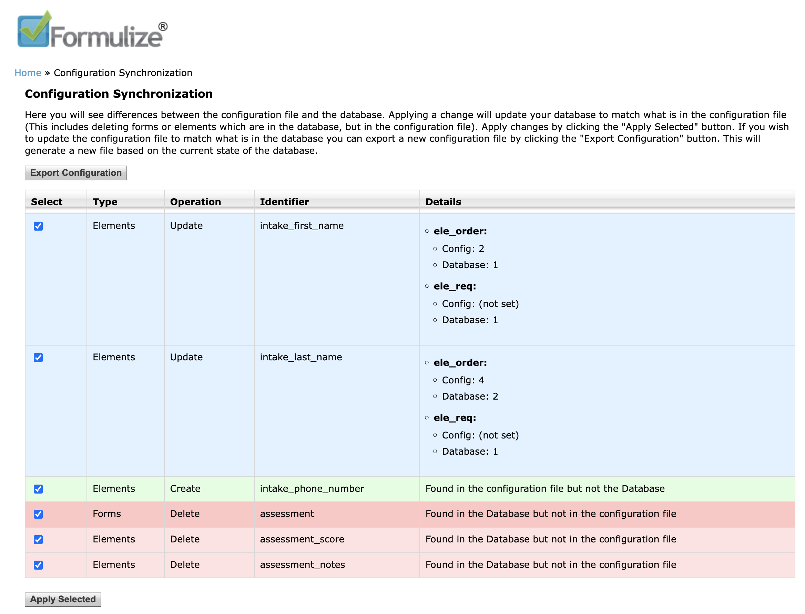

# Configuration as code

Formulize now supports configuration-as-code for Forms and Elements. This allows you to version control your sites configuration. Since Formulize is a database driven application the configuration as code acts as a synchronization of the datatabase to match what is stored in the configuration file. The configuration file is considered the source of truth. This does not prevent you from making configuration changes in your formulize instance, instead it allows you to see if your formulize configuration has deviated from what's store in the configuration and synchronize/revert if necessary.

To access the configuration screen. Go to the formulize admin page and click on the "Configuration Synchronization" link. It can also be accessed directly by adding the following to the path of your formulize url `modules/formulize/admin/ui.php?page=config-sync`

## Configuration Files

Configuration files are stored in the `modules/formulize/config` folder as JSON files (e.g. `forms.json`)

## Supported operations

When accessing the Configuration Synchronization administrative screen you can be presented with the following operations.

### Export configuration

This will export the current state of the database as a configuration file which you can then place inside the configuration folder `modules/formulize/config`

### Create

When configuration exists in the configuration file but not in the database they can be created in the database

### Update

When the same object exists in the database and in the configuration file but they differ in some way the element in the database can be updated to match what is in the configuration file. The differing values will be displayed on othe configuration screen.

### Delete

When an object exists in the database but not in the configuration file it can be deleted so that the database matches what is in the configuration file.

## Example workflow

Here is an example of how you could use the configuation-as-code functionality when building a formulize application.

1. Build and configure your forms in the UI as you normally would.
1. Once you are happy with the set up go to the configuration synchronization page and export the configuration. Place this file in the config directory `modules/formulize/config`
1. Commit this file into your repository
1. As you continue to make changes to your application you can periodically do one of the following.
	1. revert the selected changes if you aren't happy with them
	1. Perform a new export and overwrite the file in the config directory

